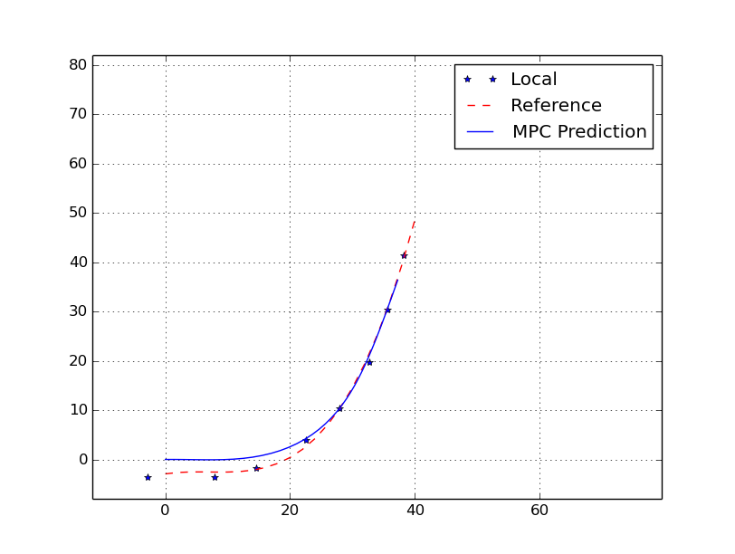

# CarND - Model Predictive Control Project
---

## Overview
The goal of this project is to implement a Model Predictive Controller to drive a car as fast as possibly on the track safely in the simulator. The following animation shows how my controller works. The yellow line is the reference path and the green line is the MPC predicted trajectory.


To see the complete video, checkout out [this link](https://youtu.be/8qDJUKbodao).

## Dependencies
I created a docker image that includes all the dependencies. Apart from those, I managed to get Qt creator to work in the container so that I could debug my program. To build the image: 

```
cd docker
./build.sh
```
The script will create an image called *carnd-term2*. To run the container:

`./run_term2_docker.sh`

It will mount the **current** directory into the container as **/src**. That means you could keep all the source code outside of the container.

If you don't want to install this image, then follow [udacity's project repo](https://github.com/udacity/CarND-MPC-Project) to set up the environment.


## Build & Run

1. Clone this repo.
1. Make a build directory: `mkdir build && cd build`
1. Compile: `cmake .. && make`
1. Run it: `./mpc [path_to_config]`. Config file is optional, by default it loads "config/test.cfg".

----
## Implementation

The MPC takes place in the event callback from the websocket. When a telemetry message arrives, my codes run the following 4 steps to generate the actuation commands, which is defined in the [ProcessData() function](src/utils.cpp#L136-L196).

1. Convert global waypoints into local frame
1. Fit the waypoints with 3rd order polynomial
1. Calculate the reference velocity based on road curvature
1. Build the constrains and solve the optimization problem

## Frame Transformation
The first I did was to convert everyhing into metric right-handed coordinate system. A typical telemetry frame of data looks like this:

```jason
  {
    "psi": 3.73521,
    "psi_unity": 4.118772,
    "ptsx": [
      -32.16173,
      -43.49173,
      -61.09,
      -78.29172,
      -93.05002,
      -107.7717
    ],
    "ptsy": [
      113.361,
      105.941,
      92.88499,
      78.73102,
      65.34102,
      50.57938
    ],
    "speed": 8.139975,
    "steering_angle": -0.001243055,
    "throttle": 1,
    "x": -42.01076,
    "y": 107.7916
  }
```

where,

    psi is in radian,  
    speed is in mph,  
    positive steering turns right and negative turns left,  
    ptsx, ptsy, x, y are in meter,  
    throttle is very well defined by this course
  
To avoid confusion and make code reusable, I converted speed to m/s and revserse steering angle. When the calculation is done, I then converted the steering back to the simulator format.

After conversion I then tranformed the waypoints,which are ptsx and ptsy, from global frame to vehicle's local frame. The transformation is basically a 2D shift and roatation. You could find the [transformation code](src/utils.cpp#L74-L124) in utils.cpp. The following figures show the process of frame transformation.

  

### Polynomial Fitting
After frame transformation, I used a 3rd order polynomial fitting algorithm to fit a polynomial line to the waypoints. The reason is twofold. First it smoothes the coarse waypoints and yields a smooth continuous reference path. Second, the polynomial equation is then used in the MPC to calculate the cross track error and heading error.

### Reference Velocity
The lake side track is a fairly easy track to navigate but there are indeed some winding parts that might cause accidents if driving too fast. To drive as fast as possible while remaining safe, we need to slow down to a safety speed at those winding corners and speed up at straight roads. To achieve this, I measure the mean angle change of the waypoints and determine a reference velocity for MPC at each update cycle. After trial and error, I set the maximal velocity to 100 mph and minimal velocity to 65 mph. 

### MPC
MPC is a very advanced method of process control in the industry. The main advantage of MPC is the fact that it allows the current timeslot to be optimized, while keeping future timeslots in account. This is achieved by optimizing a finite time-horizon, but only implementing the current timeslot. MPC has the ability to anticipate future events and can take control actions accordingly. In this project, the MPC uses vehicle kinematic model to predict where the car is and try to optimize the trajectory to get close to the reference path as close as possible. The controller constantly updates the prediction and only uses the current output to actuate the car.


The vehicle kinematics is defined as follows:

    X = X + V * cos(Psi) * dt  
    Y = Y + V * sin(Psi) * dt  
    Psi = Psi + V / Lf * Steer * dt  
    V = V + Acc * dt  
    
 where,
    
    x, y is the position of the vehicle,  
    psi is the heading,  
    lf is the distance from the front wheel to the center of gravity,  
    v is the velocity,  
    acc is the acceleration,  
    steer is the steering angle
    
However, the simulator only provides throttle instead of acceleration. The relationship of throttle and acceleration is not given in this course and based on my test, the relationship is positively propotional but nonlinear. So what I did was to record the last velocity and timestamp, and use the different of velocity to calculate the acceleration. The output of MPC is steering and acceleration.

Now that we have the model, we need to define the cost function so that the optimizer could have a objective to optimze. The cost function is defined as follows.

   cost = A * cte + B * epsi + C * v_error + D * delta_output + E * acc_output + F * delta_change + G * acc_change
  
 where,
 
      A, B, C, D, E, F, G are the coefficient of each term,  
      cte is the cross track error,  
      epsi is the heading error,  
      v_error is the velocity error,  
      delta_output is the magnitude of steering,  
      acc_output is the magnitude of acceleration,  
      delta_change is the change of sequential steering values,  
      acc_change is the change of sequential acceleration values  
    
 The following figure shows the predicted trajectory of given waypoints.  
 
    
### Latency Handling
In real life, there is usually a latency bewteen the commmand issue and execution. The latency is negligible when the speed is low but it caused swerving when the car reached 60 mph trying to make a turn at the curve. To compensate the latency, I basically update the vehicle state by an amount of time before feeding into the MPC solver. This process could be found in main.cpp at [line 121](src/main.cpp#121). This approach worked well for short latency at straight road and under low speed. The following figure shows the dead reckoning result for a long duration, where dashed line is the acutal measurement and solid line is the dead reckoning.


